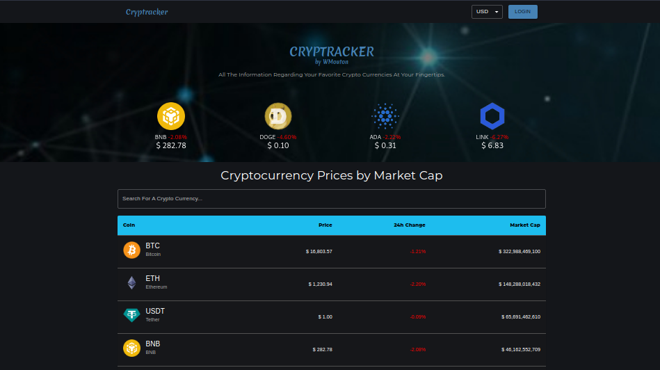

# cryptracker-crypto-tracker-project

A cryptocurrency tracker web application built with ReactJS and Material-UI.

---

<h2>View <a href="https://leeth-cryptracker.netlify.app/" target="_blank">Demo</a></h2>



---

## Usage PNPM

```bash
git clone https://github.com/l33th/cryptracker-crypto-tracker-project
cd cryptracker-crypto-tracker-project
pnpm install
pnpm run start
```

## Usage NPM

```bash
git clone https://github.com/l33th/cryptracker-crypto-tracker-project
cd cryptracker-crypto-tracker-project
npm install
npm run start
```

> When the server is up and running, open your browser and navigate to localhost:3000

---

## Deploy on Vercel

Connecting your GitHub account to Vercel will automatically deploy the repo,
it speeds up deployment and makes it much easier to get your app up and running.
